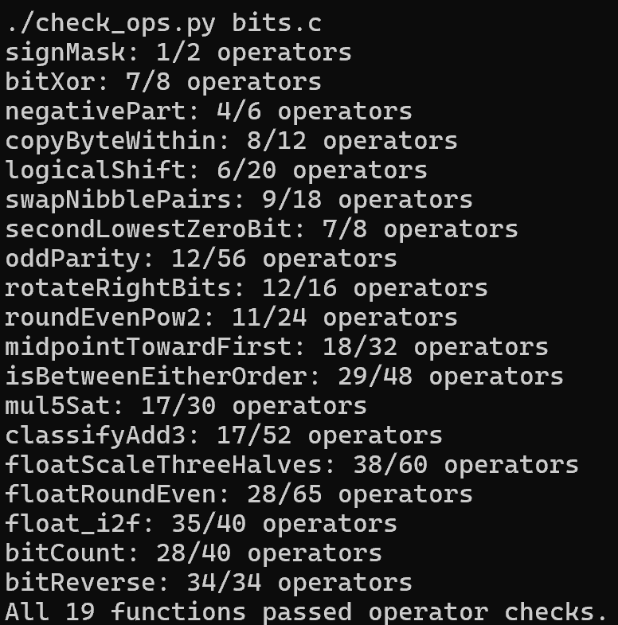
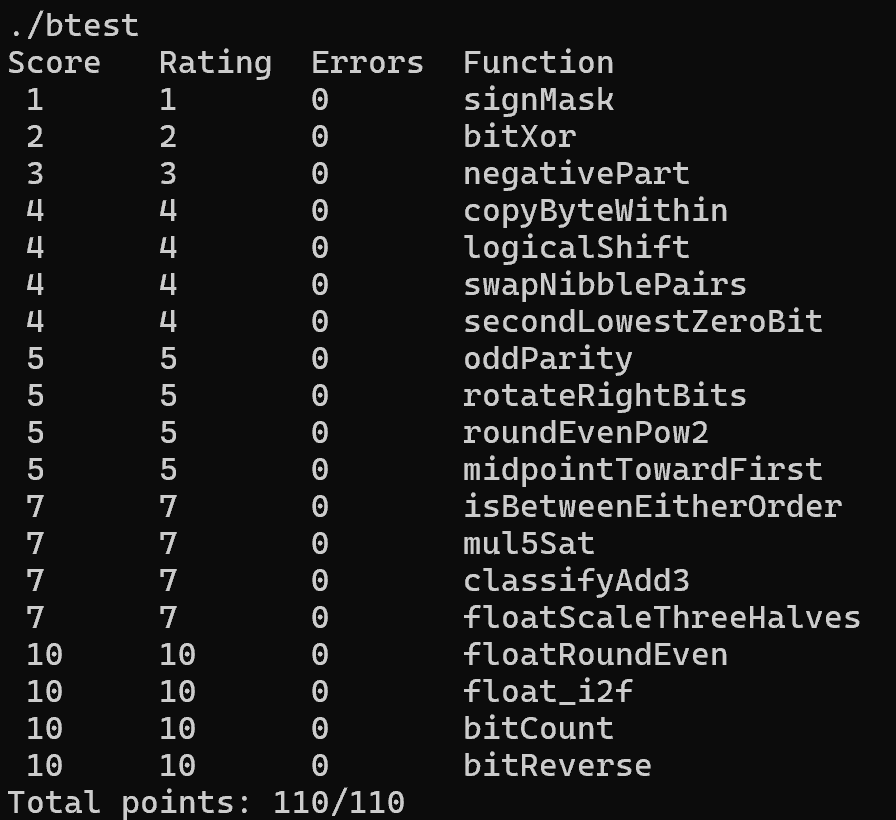

# Lab 1：Data Lab 实验报告

- 姓名：何东洋
- 学号：25800740061
- 日期：2026 年 10 月 9 日
- 仓库：https://github.com/ShadowRnO/DataLab

## 实验内容与环境

本实验在 32 位整数模型下，通过受限的位运算完成整数处理，并通过整数操作处理 IEEE 754 单精度浮点数编码。代码修改限于 `bits.c` 中 P1–P19 的函数体；函数签名、测试程序及 GitHub 评分配置保持原样。

本地测试环境为 Windows 上的 WSL 2 Ubuntu，使用 GCC、Make、Python 3，以及 `gcc-multilib` 和 `libc6-dev-i386` 提供的 32 位编译支持。按原 Makefile 的 `-O -Wall -fwrapv -m32` 选项构建。

## 实现思路

| 题目 | 实现思路 | 操作数/上限 |
| --- | --- | --- |
| P1 `signMask` | 将最低位的 1 左移 31 位，得到只有最高位为 1 的掩码。 | 1/2 |
| P2 `bitXor` | 异或表示两个对应位不同。使用德摩根律，仅用取反和按位与表达“至少一个为 1，且不是两个都为 1”。 | 7/8 |
| P3 `negativePart` | 算术右移 31 位得到符号掩码；利用补码的取反加一计算相反数，再用掩码保留负数输入对应的结果。`INT_MIN` 按题目的低 32 位模型处理。 | 4/6 |
| P4 `copyByteWithin` | 取出源字节与目标字节的异或差异，移到目标位置，再与原数异或，只改变需要替换的位。 | 8/12 |
| P5 `logicalShift` | 先算术右移，再用掩码清除高位补入的符号位。掩码在移位量为 0 时为全 1；所有移位量均在合法范围内。 | 6/20 |
| P6 `swapNibblePairs` | 构造 `0x0f0f0f0f` 掩码，分别提取每个字节的低半字节和高半字节，移动 4 位后合并。 | 9/18 |
| P7 `secondLowestZeroBit` | 先取反，把原数的 0 变成 1。用 `v & (v - 1)` 的位级等价写法清除最低的 1，再用 `v & (-v)` 的位级等价写法提取下一个 1。实际代码以允许的取反和加法表达减一与取负。 | 7/8 |
| P8 `oddParity` | 依次将相距 16、8、4、2、1 位的部分异或，把奇偶性折叠到最低位。按题意，1 的数量为偶数时返回 1。 | 12/56 |
| P9 `rotateRightBits` | 用 `n & 31` 得到实际移位量。逻辑右移部分和左移回绕部分按位或合并；左移量也对 32 取模，避免移位 32 位。 | 12/16 |
| P10 `roundEvenPow2` | 先求商的奇偶性。在除以 `2^n` 前加上“半程减一加商的最低位”，让小于半程的余数向下舍入、大于半程的向上舍入，中点时选择偶数商。最后左移恢复倍数。 | 11/24 |
| P11 `midpointTowardFirst` | 使用 `(x & y) + ((x ^ y) >> 1)` 计算向下取整的中点，避免直接相加溢出。若和为奇数且第一个参数更大，则加一，得到更靠近第一个参数的整数。比较时区分同号与异号。 | 18/32 |
| P12 `isBetweenEitherOrder` | 分别判断 `x` 是否小于两个端点。判断结果不同表示位于两端点之间，再补上等于端点的情况。比较时先检查符号差异，避免把溢出的减法符号当作大小关系。 | 29/48 |
| P13 `mul5Sat` | 依次计算两倍、四倍和五倍。检查这些结果是否改变了原输入的符号；若发生溢出，根据输入符号选择 `INT_MAX` 或 `INT_MIN`，否则保留五倍结果。 | 17/30 |
| P14 `classifyAdd3` | 分两次相加，分别检测有符号溢出并记录方向。一次正溢出表示数学结果比机器结果多 `2^32`，负溢出则少 `2^32`；两次方向修正相加，可识别最终溢出，也能处理两次溢出相互抵消的情况。 | 17/52 |
| P15 `floatScaleThreeHalves` | 分离符号、阶码和有效数字，用整数计算有效数字乘三，再通过移位实现除二与规格化。只在最终保留位确定后按最近偶数规则舍入，处理非规格化数、阶码进位和溢出。保留正负零，NaN 和无穷保持原编码。 | 38/60 |
| P16 `floatRoundEven` | 根据阶码确定小数位位置。绝对值不超过 0.5 时舍入为带原符号的零；其余小数部分通过掩码分离，再根据余数与半程大小、保留整数的奇偶性决定进位。NaN、无穷和已无小数位的值保持原编码。 | 28/65 |
| P17 `float_i2f` | 先用无符号数保存绝对值，使 `INT_MIN` 也可表示。找到最高有效位，确定阶码；低位需要丢弃时按最近偶数规则舍入，并处理舍入使有效数字进位的情况。 | 35/40 |
| P18 `bitCount` | 用掩码并行统计相邻 2 位、4 位和 8 位中的 1 的数量，再合并各字节的计数，取低 6 位得到 0–32 的结果。 | 28/40 |
| P19 `bitReverse` | 分别交换相邻 1 位、2 位、4 位、8 位和 16 位分组。由低 16 位掩码逐步异或移位构造其他掩码，减少掩码构造的操作数，使总数正好满足 34 次上限。 | 34/34 |

## 测试结果

在实验目录内运行：

```sh
make clean
make all
./check_ops.py bits.c
./btest
```

规则检查结果：

```text
All 19 functions passed operator checks.
```

正确性检查中每题 `Errors` 为 0，最终结果为：

```text
Total points: 110/110
```

原仓库的一键脚本 `./test.sh` 也通过，并返回状态码 0。额外测试在仓库之外保存，使用固定随机种子，对课程参考函数进行了 3,605,944 次比较，全部通过。其中包含整数极值、饱和阈值、端点顺序、循环移位，以及正负零、非规格化数、NaN、无穷和浮点舍入边界。抽样和边界测试不能替代全输入空间的形式化证明。





另按仓库 GitHub Actions 中的 64 位编译选项 `-O -Wall -fwrapv` 构建正确性测试程序，本地结果同样为 `110/110`。这仍是本地验证，不等同于 GitHub Actions 的最终评分。上传后还需核对最终提交对应的 Actions 运行结果。

## 参考资料

- [课程 Lab 1 说明](https://ics-26fall-fdu.github.io/labs/lab1-data-lab/)
- [本实验仓库](https://github.com/ShadowRnO/DataLab)的 `README.md`、`bits.c` 题目注释及测试参考函数。
